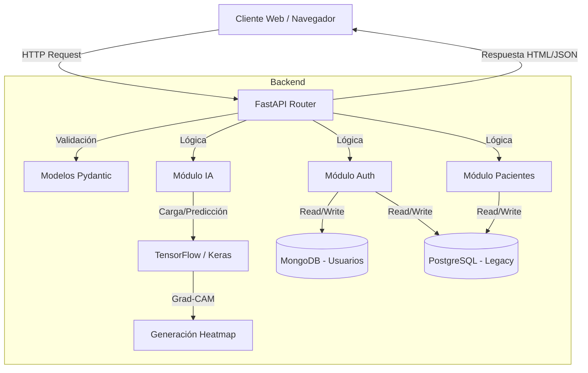

# Proyecto Neumonía - Sistema de Detección con IA

Este proyecto es una aplicación web full-stack diseñada para ayudar a especialistas médicos en la detección temprana de neumonía a partir de radiografías de tórax, utilizando Inteligencia Artificial para el análisis de imágenes.

## 🏗 Arquitectura del Sistema

El sistema utiliza una arquitectura **Modular Monolítica** basada en capas, impulsada por **FastAPI**. Se ha diseñado priorizando la separación de responsabilidades para facilitar el mantenimiento y la escalabilidad.

### Componentes Principales

1.  **Capa de Presentación (Frontend)**:
    -   **Tecnología**: HTML5, CSS3, JavaScript (Vanilla).
    -   **Renderizado**: Server-Side Rendering (SSR) utilizando **Jinja2 Templates**.
    -   **Interacción**: Fetch API para comunicación asíncrona con los endpoints JSON.

2.  **Capa de API (Backend)**:
    -   **Framework**: **FastAPI**. Maneja el enrutamiento, validación de datos (Pydantic) y seguridad.
    -   **Controladores**: Definidos en `mainTEST.py` (y `main.py` legacy), orquestan el flujo entre la petición y la lógica de negocio.

3.  **Capa de Lógica de Negocio (Módulos)**:
    Ubicada en el directorio `/modules`, encapsula la funcionalidad core:
    -   `ai_model.py`: Carga el modelo de **Deep Learning (InceptionV3 fine-tuned)**. Implementa **Grad-CAM** para generar mapas de calor explicativos sobre las radiografías.
    -   `auth.py`: Lógica de autenticación y gestión de usuarios.
    -   `patients.py`: Gestión de historias clínicas de pacientes.

4.  **Capa de Datos**:
    -   **SQL (PostgreSQL)**: Almacenamiento relacional para médicos (legacy) y pacientes. Gestionado vía `psycopg2`.
    -   **NoSQL (MongoDB)**: Nuevo sistema de registro de especialistas con verificación por correo.
    -   **Sistema de Archivos**: Almacenamiento temporal de imágenes procesadas.

### 🔄 Diagrama de Flujo de Datos

## 📚 Librerías y Tecnologías

El proyecto se construye sobre un stack robusto de Python:

| Categoría | Librería | Propósito |
| :--- | :--- | :--- |
| **Web Framework** | `fastapi`, `uvicorn` | Servidor de alto rendimiento y API asíncrona. |
| **Validación** | `pydantic`, `email-validator` | Validación estricta de datos de entrada. |
| **Base de Datos** | `psycopg2-binary`, `pymongo` | Drivers para PostgreSQL y MongoDB. |
| **Inteligencia Artificial** | `tensorflow`, `numpy`, `opencv-python` | Ejecución del modelo neuronal y procesamiento matricial. |
| **Procesamiento de Imagen** | `Pillow`, `matplotlib` | Manipulación de imágenes y mapas de color. |
| **Utilidades** | `python-dotenv`, `python-multipart` | Variables de entorno y manejo de subida de archivos (imágenes). |
| **Notificaciones** | `fastapi-mail` | Envío de correos electrónicos transaccionales. |

## 🧠 Funcionamiento del Modelo de IA

El núcleo del sistema es un modelo de **Red Neuronal Convolucional (CNN)**.

1.  **Entrada**: Recibe una imagen de rayos X en formato binario.
2.  **Preprocesamiento**:
    -   Conversión a RGB.
    -   Redimensionamiento a `224x224` píxeles.
    -   Normalización de valores de píxeles (0-1).
3.  **Predicción**: El modelo `InceptionV3` clasifica la imagen entre **NORMAL** y **PNEUMONIA**.
4.  **Explicabilidad (Grad-CAM)**:
    -   Se extraen los gradientes de la última capa convolucional (`mixed10`).
    -   Se genera un mapa de calor que resalta las regiones determinantes para la decisión del modelo.
    -   Este mapa se superpone a la imagen original y se devuelve al cliente.

---
*Generado automáticamente por Antigravity*
